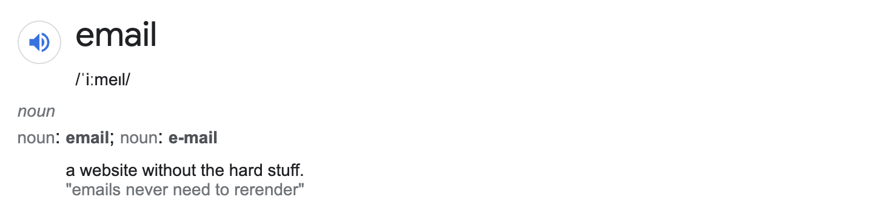

# Bring email back into code-land

It's never been easier to create and deploy a website in a couple minutes. Web development tooling is mind-boggling in terms of breadth, quality and complexity. We've come a long way.

But the email ecosystem has barely progressed at all.

Websites reap the benefits of the lastest HTML, CSS and JavaScript features, courtesy of browsers staying up-to-date. Conversely, writing emails in HTML is a known minefield for developers. Email clients are the Homer Simpsons of the tech world: they barely work and haven't changed since 2001.

### How did this happen?

Transactional email uniquely treads the line between the development and marketing teams. Since marketers are already sending out marketing emails via campaigns, transactional emails are seen as an extension of this, but with a bit more personalisation. However, I see them as closer to a website than an email, given the complexity and dynamacy of what's being sent. In practice, the developers spend an increasing amount of time "out of water" trying to figure out how to loop over a variable, among a sea of HTML comments and nested `<tr>` tags.

Because marketers tend to kick off the email process, that's who these tools are made for. But the marketing side is the easy part, and the complexity left to developers remains unevolved for 20 years. Alas, developers are stuck using a drag-and-drop email editor where it _only_ takes days to change the color of a button across all email templates.

And yet, we give them the same treatment, because marketing emails and transactional emails have the same last name.

## Why is email so painful?

If you can code a website, you can certainly code an email.
We don't avoid writing emails because it's _hard_. We avoid writing emails because it's _painful_.

Below are a few (a lot) of my gripes with the way emails work in \[current year\].

### Correctness

The underlying reason developers don't hand-write emails more often, is because it's unclear whether they will actually work in a given email client. It's not difficult, per se, but it is tedious, and requires esoteric knowledge of how email clients work across the board. Consequently, writing emails by hand requires being masochistic enough to endure using only the most basic web-based techniques to achieve a simple layout and style. Sure, writing complex React code for a website is much more complex. But writing emails using raw code is boring and finnicky, which is somehow worse.

### Theming

One of the first obstacles you'll run into is theming. Need to change the logo in the footer, or the font for all headings? Say goodbye to the rest of the day. Many developers pray to the Don't Repeat Yourself (DRY) gods every morning, and this amount of repitition is pure blasphemy. This so-called theming problem is trivially solved in code. Not so for drag-and-drop editors.

### Variables and Dynamic data

Variables, or "Dynamic Data" in the email marketing world, allow us to personalise our emails. When our email is merely `Hello, {{ firstName }}`, this is sufficient. But when we are iterating over seventeen different products, it quickly becomes complicated, unmaintainable and flakey. In code-world, looping and variables are part of the fabric of any coding language. In email-land they're basically a tacked-on experimental feature.

### Components and Blocks

Similar to theming, we like to extract commonly used elements into reusable components. React itself was fundamentally born out of this desire. In email-land, however, there are rarely any opportunities to do this, outside of hacky snippets-based solutions. Code reuse is a technique taught in Coding 101, yet email-land again laughs in the face of these methods we typically rely on.

### Safety

Come time to finally sending off our transactional email, we pass in our variables and pray for the best. Does it work? No idea, we'll just have to wait and see. With the resurgence of type-based programming languages, like TypeScript and even typed Python, it's clear that static type checking is worth the trouble, instilling us with more confidence that our programs actually work before sending them into the world. But using email (the most fundamental communication method our applications use), we just throw off an email and cross our fingers.

### Vendor lock-in

Since we're putting all our eggs (templates) in one basket (service), and that one service handles the templating, delivery, automation and mailing list, if prices get hiked or service quality drops, we have a very difficult time escaping. In the same way that we don't have to rewrite our entire website to change hosting providers, our content and work shouldn't be tied to a single email service. And no, adding an "export ugly illegible HTML" button doesn't count.

### Templates as a selling point

On the topic of the templates, email services typically tout their library of templates as a selling point. If we could take templates out of the email service provider ecosystem, they could finally focus on the hard parts... like actually getting your email into someone's inbox.

## It's time for email to grow up

> The best time to plant a tree was thirty years ago. The second best time is now.

With all of the problems plaguing email, I think it's time for an improvement. An ideal email development environment would probably:

- Allow writing emails using React
- Work across all major email clients
- Support theming
- Offer type-safety
- Be agnostic to email delivery service
- Deploy via CI/CD
- Have built-in versioning/roll-back support
- Support components and abstractions

It turns out, this is actually very doable.

The result is called [Brail](https://github.com/sinclairnick/brail). And I've been using it in production for 7 months now, worry free. My workflow looks like creating a themed email template in a few minutes, `git push`ing to Vercel who hosts the templates, API and assets, and then re-generating a type-safe client on my backend, fixing any newfound (statically checked) errors if the dynamic data provided is incorrect.

I'm now happy enough with it's stability to share it with the rest of the world. [Learn more](/docs/Introduction/intro) about Brail, or check it out on [GitHub](https://github.com/sinclairnick/brail).
